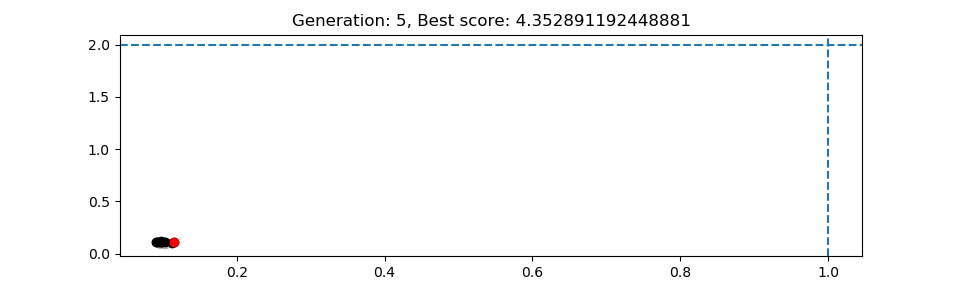

.. _optimisation

Optimisation
============

This is an experimental feature which is at an early stage of development.  The
aim is to enable equilibria to be automatically optimised. This has the
following components:

#. Measures, a quantity which measures how "good" a solution is. Typically the
   aim is to minimise this quantity, so I suppose it's really a measure of how
   bad the solution is.
#. Controls, quantities which can be changed. These could be machine parameters
   such as coil locations, constraints like X-point location, or plasma profiles
   such as poloidal beta or plasma current.
#. An algorithm which modifies the controls and finds the best equilibrium
   according to the measure it's given. At the moment the method used is
   Differential Evolution.

Differential Evolution
----------------------

`Differential Evolution <https://en.wikipedia.org/wiki/Differential_evolution>`_ is a type
of stochastic search, similar to Genetic Algorithms, generally well suited to problems
involving continuously varying parameters.

The implementation of the algorithm is in `freegs.optimiser <https://github.com/bendudson/freegs/blob/master/freegs/optimiser.py>`_.
It is generic, in that it operates on objects but does not need to know
any details of what those objects are. To modify objects a list of
``controls`` are passed to the optimiser, each of which can set and
get a value.  To score each object a ``measure`` function is needed,
which takes an object as input and returns a value. The optimiser
works to minimise this value.

An example which uses the optimisation method is in the ``freegs`` directory.
This optimises a quadratic in 2D rather than tokamak equilibria. 100 generations
are run, with 10 solutions (sometimes called agents) in each generation.  Run
this example with the command:

::

   python test_optimiser.py

This should produce the figure below. The red point is the best solution at each
generation; black points are the other points in that generation. Faded colors
(light red, grey) are used to show previous generations. It can be seen that the
points are clustered around the starting solution, as the agents spread out, and
then around the solution as the agents converge to the minimum.

Optimising tokamak equilibria
-----------------------------

The code specific to FreeGS optimisation is in `freegs.optimise <https://github.com/bendudson/freegs/blob/master/freegs/optimise.py>`_.
This includes controls which modify aspects of the tokamak or equilibrium:

+-------------------------------+----------------------------------------------------+
|   Control                     |    Description                                     |
+===============================+====================================================+
| CoilRadius(name [, min, max]) | Modify coil radius, given name and optional limits |
+-------------------------------+----------------------------------------------------+
| CoilHeight(name [, min, max]) | Modify coil height                                 |
+-------------------------------+----------------------------------------------------+

Measures which can be used by themselves or combined to specify the
quantities which should be optimised:

+-------------------------------+----------------------------------------------------+
|   Measure function            |   Description                                      |
+===============================+====================================================+
| max_abs_coil_current          | Maximum current in any coil circuit                |
+-------------------------------+----------------------------------------------------+
| max_coil_force                | Maximum force on any coil                          |
+-------------------------------+----------------------------------------------------+
| no_wall_intersection          | Prevent intersections of wall and LCFS             |
+-------------------------------+----------------------------------------------------+

Each measure function takes an Equilibrium as input, and returns a
value. These can be combined in a weighted sum using
``optimise.weighted_sum``, or by passing your own function to
``optimise``.

The example `11-optimise-coils.py <https://github.com/bendudson/freegs/blob/master/11-optimise-coils.py>`_
uses the following code to reduce the maximum force on the coils,
while avoiding wall intersections::

  from freegs import optimise as opt

  best_eq = opt.optimise(eq,  # Starting equilibrium
                         # List of controls
                         [opt.CoilRadius("P2U"),
                         opt.CoilRadius("P2L"), opt.CoilHeight("P2L")],
                         # The function to minimise
                         opt.weighted_sum(opt.max_coil_force, opt.no_wall_intersection),
                         N=10,  # Number of solutions in each generation
                         maxgen=20, # How many generations
                         monitor=opt.PlotMonitor())  # Plot the best in each generation

The monitor should be a callable (here it is an object of class ``PlotMonitor``), which
is called after each generation. This is used to update a plot showing
the best solution in each generation, and save the figure to file.
