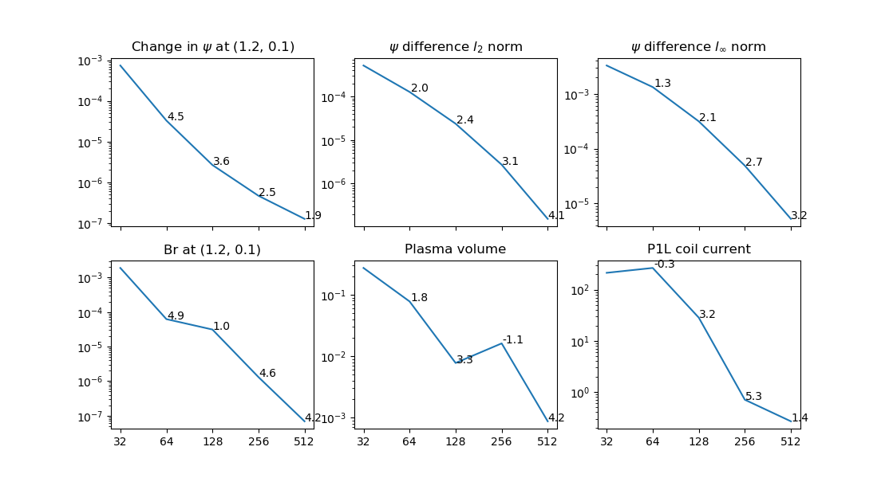

Tests
=====

Unit tests
----------

Unit testing is done with `pytest <https://docs.pytest.org/en/latest/>`_. Run the tests
in the ``freegs`` directory with:

::

   pytest
   

Convergence test
----------------

The ``test-convergence.py`` script solves for the same plasma as the
``01-freeboundary.py`` example, with four poloidal field coils and an X-point.
The change in results as the resolution is doubled is plotted as a function of
grid resolution. This is therefore not testing convergence to a known solution,
but is a check that the code converges to value, and indication of its
convergence rate.
Results are shown below, using the von Hagenow free boundary, and 4th-order solver for
the poloidal flux :math:`\psi`.

This indicates that in general convergence is between 2nd and 4th-order. The
plasma volume is currently calculated by integrating over the poloidal
cross-section, and could be improved by converting this to a surface integral.
